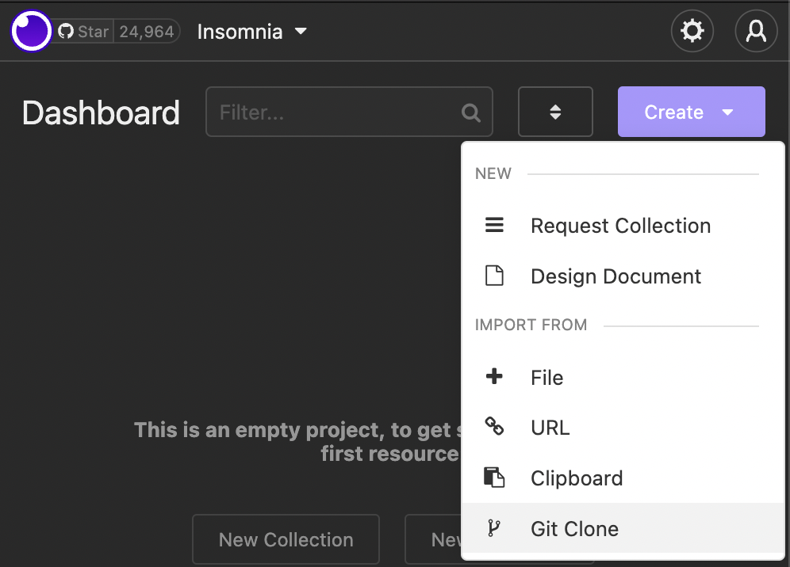

# insomnia-openapi-test

This project serves as an example of using Insomnia to produce OpenAPI doc pages via ReDoc and Github actions.

## Documentation

You can view the API docs as rendered by ReDoc here:

[OpenAPI docs live here](https://digitalmachinist.github.io/insomnia-openapi-test/)

## Getting Started with Insomnia

1. [Download and install Insomnia](https://insomnia.rest/download)

2. Click the Create dropdown and import from Git Clone

3. Authenticate with your Github account

4. Enter the Github repo URL and click Sync: `https://github.com/DigitalMachinist/insomnia-openapi-test.git` 

If everything goes as expected, a new document will be added:

5. Click the `games-serving.yaml` document.

6. Click the master branch dropdown and select Branches.

7. Select the API version you plan to implement.

Currently, `v1` is the only API version so checkout `v1`:

8. You're all set!

Your Insomnia should be set up and checked out on the correct API version, and you're ready to build your API to the spec.

## Running Tests Against Your Implementation

You can use Insomnia to validate your implementation of the API as a self-check.

- Set `base_url` to point to your API server.

- Open the `Debug` tab to call API routes with custom JSON payloads for one-off tests of routes as you work.

- Open the `Test` tab to execute our full test suite against your API implementation to validate that all your routes meet our spec.